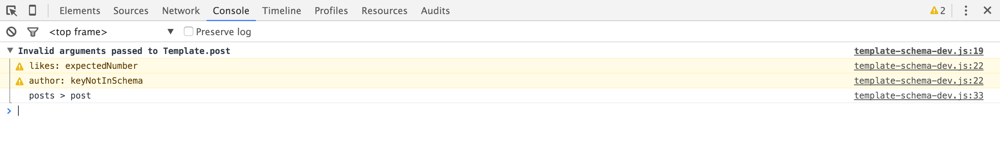

# Template Schema

Validate data context of your blaze templates and get meaningful error messages.

## Simple usage

`meteor add mpowaga:template-schema`

```html
<template name="post">
  <h1>{{title}}</h1>
  <p>{{content}}</p>
  <small>Likes: {{likes}}</small>
</template>

<template name="posts">
  {{#each postItem in posts}}
    {{> post postItem}}
  {{/each}}
</template>
```

```javascript
Template.post.schema({
  title: { type: String },
  content: { type: String },
  likes: { type: Number }
});

Template.posts.helpers({
  posts() {
    return [
      {
        title: 'Hello World',
        content: 'This is my next essay...',
        likes: '10',
        author: Meteor.users.findOne()
      }
    ];
  }
});
```

This will produce following error in your console:


